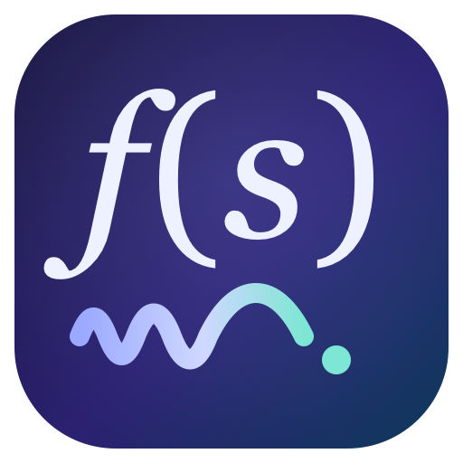

<p align="center">
  
</p>

<h1 align="center">Flowstate</h1>

<p align="center"><b>Fully local push-to-talk dictation for macOS.</b><br>
Hold a key, speak, release: clean, correctly-spelled text appears at your cursor a second later.</p>

> *you say:* "um so basically we should uh fine tune the model with pie torch, no wait, with MLX"
>
> *Flowstate types:* `We should fine-tune the model with MLX.`

## Vision

**Human-Machine Interaction.** I want the tool to disappear. For decades we
shaped ourselves to the machine, learning to think in its keyboards, its syntax,
its menus. I built Flowstate on the reverse bet: the machine should bend to us.
Speech is our oldest interface, and I want the gap between a thought and its text
to shrink to whatever the hardware allows.

That closeness has to stay yours. Since the tool hears everything I say, I keep
the whole loop on my own machine: my voice, my corrections, and my vocabulary
never leave it, and it learns my words instead of demanding I learn its commands.
I want an assistant quiet enough to vanish into the work, so that intention goes
in and language comes out with nothing in between.

## Why this is different

Dictation tools either send your voice to the cloud, or run locally and hand
you raw, filler-riddled transcripts that mangle every technical term. Flowstate
refuses both trade-offs:

- **Nothing leaves your Mac.** Speech-to-text (whisper.cpp or Kyutai) and the
  cleanup LLM (llama.cpp, 3B) run as warm local child processes on loopback.
  No account, no API key, no subscription, works in airplane mode. Cloud
  (Groq) exists only as an explicit opt-in.

- **It knows technical vocabulary out of the box.** ~610 built-in terms across
  software engineering, AI/ML, data science, econometrics, and quant finance
  (`PyTorch`, `kubectl`, `gRPC`, `Black-Scholes`, `heteroskedasticity`,
  `NeurIPS`, `Claude Code`, `Kimi`), biased into the recognizer per app
  context (code terms in editors, econ/AI terms everywhere).

- **Three repair layers, engineered to never make things worse.**
  1. *Decoder biasing*: your vocabulary is fed into Whisper's prompt.
  2. *Deterministic corrector*: a pure, exact-match pass fixes casing,
     hyphenation, and ~30 curated mishearings ("pie torch" → `PyTorch`,
     "cube control" → `kubectl`, "cloud code" → `Claude Code`) instantly,
     with structural guards so it can never rewrite ordinary English.
  3. *Local LLM cleanup*: removes fillers, applies self-corrections
     ("meet at 2, no wait, 3" → "meet at 3"), repairs remaining misheard
     terms. ~0.3 s warm; a cold model falls back to the raw transcript
     rather than ever blocking your paste.

- **It learns from you.** Fix a term in text Flowstate just pasted, and it
  notices (one Accessibility read-back of that same field). A correction that
  recurs joins your vocabulary automatically. Only the learned *term* is ever
  stored, never your document text. Fully local, capped, and one config flag
  to disable.

- **Boring, auditable engineering.** Pure Swift/SwiftPM, zero external Swift
  dependencies, builds with Command Line Tools only (no Xcode). One binary,
  two optional local servers, 803 tests including live integration against
  the real STT and LLM servers.

## Setup

Apple Silicon Mac, macOS 13+, [Homebrew](https://brew.sh), and Xcode Command
Line Tools (`xcode-select --install`).

### 1. Get the code and the speech model

```sh
git clone https://github.com/henryph24/flowstate.git && cd flowstate

brew install whisper-cpp
MODELS="$HOME/Library/Application Support/Murmur/models"
mkdir -p "$MODELS"
# --fail: don't save an error page as the .bin; .partial + mv: an interrupted
# download never looks installed.
curl -L --fail --retry 3 -C - -o "$MODELS/ggml-large-v3-turbo.bin.partial" \
  "https://huggingface.co/ggerganov/whisper.cpp/resolve/main/ggml-large-v3-turbo.bin" \
  && mv "$MODELS/ggml-large-v3-turbo.bin.partial" "$MODELS/ggml-large-v3-turbo.bin"
```

(~1.6 GB, best accuracy. Lighter option: `ggml-small.en.bin`, ~490 MB, ~0.2 s
per utterance; point `whisperModelPath` at it in the config.)

### 2. Install the local cleanup LLM (recommended)

```sh
./scripts/install_llama.sh
```

Installs llama.cpp via Homebrew and downloads a 3B instruct model (~2 GB).
Skippable: dictation and the deterministic corrector work without it; you
lose filler removal and phonetic repair.

### 3. Build and install the app

```sh
./scripts/make_app.sh
open ~/Applications/Flowstate.app
```

### 4. Permissions and the hotkey

- **Microphone**: prompted on first recording.
- **Accessibility**: prompted at launch (System Settings → Privacy &
  Security → Accessibility). Powers the global hotkey, the paste, and the
  optional auto-learn read-back (one read of the field you just dictated into;
  `"autoLearnEnabled": false` disables it). Accessibility is macOS's broadest
  permission: grant it only to software you trust; the source is here to audit.
- **`fn` key**: System Settings → Keyboard → *"Press 🌐 key to"* → **Do
  Nothing**. Prefer another key? `"hotkey": "rightCommand"` in
  `~/.config/murmur/config.json`.

Hold `fn`, say something, release. You're dictating.

### 5. (Recommended) A stable signing certificate

macOS ties permission grants to the app's code signature; ad-hoc signatures
change on every rebuild and silently kill the Accessibility grant. Once:
Keychain Access → Certificate Assistant → *Create a Certificate…* → name
**Murmur Dev**, Identity Type *Self-Signed Root*, Certificate Type *Code
Signing*. `make_app.sh` finds and uses it automatically. Recovery after a
lost grant: `tccutil reset Accessibility dev.hungpq.murmur`, re-grant.

### Optional extras

| What | How |
|---|---|
| Streaming STT (live words in the HUD) | `./scripts/install_kyutai.sh`, then menu → engine → Kyutai |
| Cloud STT/cleanup (Groq) | menu → *Set API Key…*; `"cleanupEngine": "groq"` for cloud cleanup |
| Reuse a GGUF you already have | point `llamaModelPath` at any instruct GGUF (e.g. LM Studio's cache) |

> **Groq is the one path that leaves your Mac.** Enabling it uploads your
> recorded audio and the transcript (including any auto-learned vocabulary
> terms) to Groq's API over HTTPS. Everything else (STT, cleanup, corrector,
> auto-learn) is local. Your Groq API key is stored in cleartext at
> `~/.config/murmur/config.json` (file mode `0600`, in a `0700` directory).

## Using it

- **Hold to talk**; a pill HUD shows state. Release to transcribe and paste
  into the frontmost app. Tap any other key while holding (or release within
  0.25 s) to cancel.
- **Password fields**: in secure-input contexts Flowstate never types; the text
  is placed on the clipboard for you to paste, marked *concealed*, and cleared
  ~60 s later (restoring your previous clipboard) unless you replace it first.
- **Clipboard-safe**: your previous clipboard is snapshotted and restored ~0.6 s
  after the paste (unless you copied something new meanwhile). Dictated text is
  marked *concealed* / auto-generated, so clipboard managers and Universal
  Clipboard skip it instead of archiving every utterance.
- **Menu bar**: engine picker, AI Cleanup toggle, Dock icon, start at login.

## Vocabulary: built-in, yours, and learned

Built-in terms are always on (`"builtinVocabularyEnabled": false` opts out).
Your own terms in `~/.config/murmur/config.json` win over built-ins (budget,
casing, everything):

```jsonc
{
  "customVocabulary": ["Jane Doe", "VNDirect", "quintile portfolio"],  // every app
  "codeVocabulary": ["MurmurKit", "FnStateMachine"],                   // editors/terminals only
  "vocabularyAliases": { "vee end direct": "VNDirect" }                // spoken-form fixes
}
```

Auto-learn adds terms you correct by hand (≥2 recurrences, 50-term cap,
oldest evicted; sidecar `~/.config/murmur/autolearn.json` stores terms only).
`"autoLearnEnabled": false` disables it.

## Configuration reference

`~/.config/murmur/config.json`: every key optional; defaults shown.
Restart Flowstate after editing.

```jsonc
{
  "hotkey": "fn",                   // fn | rightCommand
  "engine": "whisperCpp",           // whisperCpp | kyutai | groq
  "cleanupEnabled": true,           // the LLM pass (corrector always runs)
  "cleanupEngine": "local",         // local | groq
  "language": "en",
  "customVocabulary": [],
  "codeVocabulary": [],
  "vocabularyAliases": {},
  "builtinVocabularyEnabled": true,
  "autoLearnEnabled": true,
  "showDockIcon": false,
  "groqAPIKey": null,               // or GROQ_API_KEY env (dev runs)
  "sttModel": "whisper-large-v3-turbo",      // Groq STT model id
  "cleanupModel": "llama-3.1-8b-instant",    // Groq cleanup model id
  "whisperBinaryPath": "/opt/homebrew/bin/whisper-server",
  "whisperModelPath": "~/Library/Application Support/Murmur/models/ggml-large-v3-turbo.bin",
  "whisperPort": 8723,
  "llamaBinaryPath": "/opt/homebrew/bin/llama-server",
  "llamaModelPath": "~/Library/Application Support/Murmur/models/Llama-3.2-3B-Instruct-Q4_K_M.gguf",
  "llamaPort": 8725,
  "kyutaiBinaryPath": "~/.cargo/bin/moshi-server",
  "kyutaiPort": 8090,
  "minHoldSeconds": 0.25,
  "maxRecordSeconds": 600,
  "pasteboardRestoreDelay": 0.6
}
```

## Developing

```sh
swift build                  # SwiftPM only, no Xcode required
swift run Murmur             # dev run, inherits the terminal's permissions
swift run MurmurTests        # 803 unit + local-integration assertions
```

Dev-loop env overrides: `MURMUR_HOTKEY`, `MURMUR_ENGINE`,
`MURMUR_CLEANUP_ENGINE`, `MURMUR_AUTOLEARN_DELAY`, `GROQ_API_KEY`.
Architecture, hard-won constraints, and conventions live in `CLAUDE.md`.

*(Formerly Murmur: the bundle id `dev.hungpq.murmur`, `MurmurKit` module,
and `~/.config/murmur` paths keep the old identity so upgrades preserve
permissions and data.)*

## Troubleshooting

- **Hotkey dead after a rebuild** → you're signing ad-hoc; create the
  **Murmur Dev** cert (step 5) and `tccutil reset Accessibility
  dev.hungpq.murmur`.
- **`fn` unreliable** → `"hotkey": "rightCommand"`.
- **Is cleanup actually on?** → run `swift run Murmur` from a terminal; the
  startup log reports the active engines, vocabulary counts, and the exact
  reason cleanup is off (e.g. `run scripts/install_llama.sh`).
- **Auto-learn does nothing in Chrome/Electron apps** → those apps don't
  expose text fields to Accessibility; pasting works, learning silently
  skips.
- Launch the installed app with `open ~/Applications/Flowstate.app`; running
  the bundled binary directly from a shell mis-attributes permissions to the
  terminal.
